# Legal Assistant - Implementation Plan

A production-grade AI assistant for **Indian Laws, Acts & Case Law (Judgments)**, featuring a Smart Parser, Hybrid Search with Reranking, Judgment Analysis (Viability Predictor, Argument Miner, Clause Search), and a React-based UI.

## Prerequisites & Dependencies

> [!IMPORTANT]
> **External Services Required**: Ensure all API keys are configured in `.env` before running.

| Service | Purpose | Provider |
| :--- | :--- | :--- |
| **LLM** | Chat generation | Groq (Llama-3.3-70b) |
| **Embeddings** | Vector search | Mistral (mistral-embed) |
| **Vector DB** | Storage & search | MongoDB Atlas |
| **Reranking** | Result refinement | Cohere |
| **Vision OCR** | Scanned PDF fallback | Groq (Llama-3.2-Vision) |

> [!TIP]
> All providers are **configurable via `.env`**. You can swap Groq for OpenAI, Mistral for OpenAI embeddings, etc.

### PDF Parsing Strategy

| Step | Condition | Action |
| :---: | :--- | :--- |
| 1 | Text-selectable PDF | Extract via `PyMuPDF` (fitz) with layout analysis |
| 2 | Page has < 50 characters | Screenshot → Vision LLM → Extract text |
| 3 | Margin/Footer Noise | **Clip Page** (remove ~110pt margins) + Regex artifact cleanup |

> [!NOTE]
> **Deferred Features**: IPC ↔ BNS Bridge Logic (mapping old to new criminal codes) is out of scope for v1.

---

## Open Questions (Team Discussion Required)

> [!WARNING]
> The following design decisions need team input before implementation.

### Q1: MongoDB Collection Strategy

**Problem**: We have two different document types with different schemas:
- **Acts/Sections**: `section_id`, `chapter`, `has_illustration`, etc.
- **Judgments**: `Titles`, `Court_Name`, `Cites`, `Cited_by`, `Outcome`, etc.

| Option | Pros | Cons |
| :--- | :--- | :--- |
| **Option A: Single Collection** | Simpler queries, unified search | Schema complexity, sparse fields |
| **Option B: Two Collections** | Clean schemas, type-specific indexes | Cross-collection search complexity |

**Recommendation**: _TBD by team_

---

### Q2: Judgment Chunking Strategy

**Problem**: Judgment texts are very large (50k-100k+ characters). We cannot:
- Store entire text as single chunk (embedding quality degrades)
- Send entire judgment to LLM (token limits, cost)

| Strategy | Description | Chunk Size | Overlap |
| :--- | :--- | :--- | :--- |
| **Paragraph-based** | Split by `\n\n` (paragraph breaks) | Variable | 0 |
| **Fixed Token** | Split every N tokens | 500 tokens | 100 tokens |
| **Semantic Sections** | Split by legal structure (Facts, Arguments, Ruling) | Variable | 50 tokens |
| **Recursive Splitter** | LangChain RecursiveCharacterSplitter | 1000 chars | 200 chars |

**Key Considerations**:
- For **Argument Miner**: Need arguments + ruling in same chunk
- For **Clause Search**: Need exact quoted text + context
- For **Viability**: Need outcome + key facts together

**Recommendation**: Recursive Splitter with **large overlap (200 tokens)** to preserve context.

---

### Q3: Judgment Metadata Extraction

**Problem**: The `Outcome` field is not in the source JSON - it's buried in the text.

| Approach | Description | Accuracy |
| :--- | :--- | :--- |
| **Regex** | Search last 500 chars for "Dismissed", "Allowed", etc. | ~80% |
| **LLM Extraction** | Send last 1000 chars to LLM, ask for outcome | ~95% |
| **Manual Labeling** | Human review for POC dataset | 100% |

**Recommendation**: Start with **Regex** for POC, upgrade to LLM later.

---

## Design Decisions (Team Review - Resolved)

> [!IMPORTANT]
> The following decisions were finalized based on team review feedback.

### D1: PII & Sensitive Data Handling

**Concern**: Judicial data may contain personally identifiable information (PII), juvenile cases, sexual offences, etc. that require restricted access.

**Decision**: Implement dual-storage approach with access controls.

| Storage | Content | Access |
| :--- | :--- | :--- |
| **Original Store** | Full unredacted judgment text | Admin/Privileged roles only |
| **Vector DB** | Sanitized/anonymized chunks | All authenticated users |

**Implementation Plan**:
1. **Ingestion Pipeline**: Detect sensitive content (regex patterns for names, addresses, case numbers)
2. **Sanitization**: Replace PII with placeholders (`[PETITIONER]`, `[VICTIM]`, `[ADDRESS]`)
3. **Access Control**: Role-based access via MongoDB field-level security
4. **Audit Trail**: Log all access to original sensitive documents

**Enhancements**:
- **Field-Level Encryption**: Use MongoDB Client-Side Field Level Encryption (CSFLE) for original documents
- **Sensitive Case Categories**: Auto-detect and flag:
  - POCSO Act cases (Protection of Children from Sexual Offences)
  - Juvenile cases
  - Cases marked "Identity Protected" or "In-Camera Proceedings"
- **Auto-Exclude Rule**: POCSO/Juvenile cases → **Never store in public vector DB**
- **IAM Integration**: Support Azure AD / Okta for enterprise SSO

---

### D2: Hallucination Prevention & RAG Quality Control

**Concern**: Legal AI must be accurate. System should NOT answer if retrieved context is insufficient.

**Decision**: Implement confidence thresholds at multiple stages.

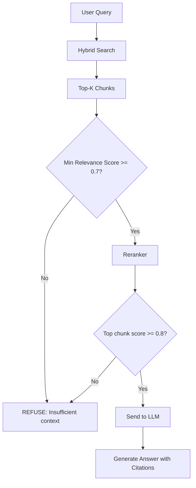

**Threshold Configuration** (in `.env`):

| Variable | Description | Default |
| :--- | :--- | :--- |
| `RAG_MIN_VECTOR_SCORE` | Minimum vector similarity | `0.6` |
| `RAG_MIN_RERANK_SCORE` | Minimum reranker score | `0.7` |
| `RAG_MIN_CHUNKS_REQUIRED` | Minimum relevant chunks needed | `2` |
| `RAG_REFUSE_MESSAGE` | Message when context insufficient | `"I don't have enough information..."` |

**LLM Prompt Safeguard**:
```
IMPORTANT: Only answer based on the provided context. 
If the context does not contain relevant information, respond with:
"I don't have sufficient information in my knowledge base to answer this question accurately."
Do NOT make up information.
```

**Enhancements**:
- **Chunk Diversity Check**: Ensure retrieved chunks come from at least 2 different documents (avoid single-source bias)
- **Knowledge Gap Logging**: Log all refused queries for analysis → identify missing content areas
- **Confidence Disclaimer UI**: When score is between 0.7-0.85, show:
  > *"This response is based on limited relevant context. Please verify with original sources."*
- **Citation Verification**: Cross-check that cited sections actually exist in the database

---

## Data Sources

### Primary Sources

| Act | Replaces | Source | Parser Mode |
| :--- | :--- | :--- | :--- |
| **BNS** (Act 45/2023) | IPC, 1860 | [MHA PDF](https://www.mha.gov.in/sites/default/files/250883_english_01042024.pdf) | **Narrative** (Illustrations) |
| **BNSS** (Act 46/2023) | CrPC, 1973 | (https://www.mha.gov.in/sites/default/files/2024-04/250884_2_english_01042024.pdf) | **Strict** + **Schedule** |
| **BSA** (Act 47/2023) | Evidence Act, 1872 | (https://www.mha.gov.in/sites/default/files/2024-04/250882_english_01042024_0.pdf) | **Narrative** |

### Additional Sources

| Source | URL | Content |
| :--- | :--- | :--- |
| **India Code** | [indiacode.nic.in](https://www.indiacode.nic.in/) | All Central & State Acts |
| **MHA Website** | [mha.gov.in](https://www.mha.gov.in/) | New Criminal Laws Gazette PDFs |

### Judgments Data Source (NEW)

| Phase | Source | Format | Volume |
| :--- | :--- | :--- | :--- |
| **POC** | [HuggingFace - InJudgements](https://huggingface.co/datasets/opennyaiorg/InJudgements_dataset) | Parquet → JSON | 10,000 judgments |
| **Production** | [Indian Kanoon](https://indiankanoon.org/browse/) | Web Scraping | All judgments |

#### Judgment JSON Schema

```json
{
  "Titles": "Priti Bhojnagarwala vs State Of Gujarat on 4 May, 2001",
  "Court_Name": "Gujarat High Court",
  "Cites": 72,
  "Cited_by": 2,
  "Doc_url": "https://indiankanoon.org/doc/1943657",
  "Text": "JUDGMENT H.H. Mehta, J. ...",
  "Doc_size": 75823,
  "Case_Type": "Criminal",
  "Court_Type": "High_Court",
  "Court_Name_Normalized": "Gujarat High Court"
}
```

#### Pre-processing Requirements

| Step | Action | Purpose |
| :---: | :--- | :--- |
| 1 | Extract `Outcome` from last 500 chars | Classify: Allowed/Dismissed/Acquitted/Quashed |
| 2 | Chunk with large overlap (200 tokens) | Keep arguments + judge's ruling together |
| 3 | Extract `Acts_Cited` via regex | Link judgments to Acts (IPC 302, BNS 103, etc.) |

---

### Judgment Processing Implementation (Status: ✅ Complete)

> [!IMPORTANT]
> **Approach Implemented**: LLM-based atomic chunking with anti-hallucination validation (60% fuzzy matching threshold).

#### Architecture Overview

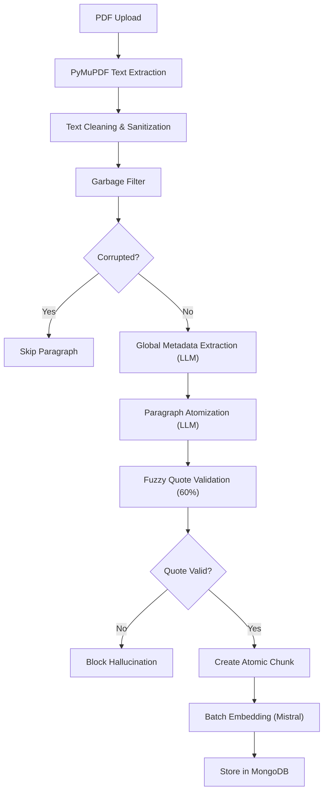

#### Key Components

| Component | Technology | Purpose |
| :--- | :--- | :--- |
| **PDF Parser** | PyMuPDF (fitz) | Fast text extraction |
| **LLM Engine** | Groq (llama-3.1-8b-instant) | Atomization & metadata extraction |
| **Embedder** | Mistral (mistral-embed, 1024d) | Same as ACT processing for unified search |
| **Vector DB** | MongoDB Atlas | Single collection with `document_type: "judgment"` |
| **Validation** | Fuzzy Matching (SequenceMatcher) | Anti-hallucination with 60% threshold |

#### Atomization Process

**1. Global Metadata Extraction**

Uses first 3000 + last 3000 characters to extract:
- `case_title` - Full case name
- `court_name` - Court that delivered judgment
- `city` - Court location
- `year_of_judgment` - Year judgment was delivered
- `outcome` - Dismissed | Allowed | Acquitted | Convicted | Disposed | Unknown
- `winning_party` - Petitioner | Respondent | State | None

**2. Paragraph-Level Atomization**

Each paragraph is sent to LLM with strict prompt:

```
CRITICAL GROUNDING RULES:
1. NO EXTERNAL KNOWLEDGE - Use ONLY input text
2. VERBATIM PROOF - Every atomic unit must have exact `supporting_quote`
3. PRONOUN RESOLUTION - Replace pronouns with actual names from context
```

**Output Structure**:
```json
{
  "content": "The Petitioner argued that the FIR was delayed.",
  "supporting_quote": "argued that the FIR was lodged with a delay",
  "section_type": "Submission_Petitioner",
  "party_role": "Petitioner", 
  "legal_topics": ["Delay in FIR"]
}
```

**3. Anti-Hallucination Validation**

```python
# Fuzzy matching to handle OCR errors
def validate_quote_fuzzy(quote: str, paragraph: str, threshold: float = 0.60):
    clean_quote = " ".join(quote.lower().split())
    clean_para = " ".join(paragraph.lower().split())
    
    # Exact match first
    if clean_quote in clean_para:
        return True
    
    # Fuzzy matching for OCR typos ("servicce" vs "service")
    for substring in sliding_windows(clean_para, len(clean_quote)):
        similarity = SequenceMatcher(None, clean_quote, substring).ratio()
        if similarity >= threshold:
            return True
    
    return False
```

**Blocked Examples**:
- ❌ `"An employee in the uniformed service is expected to uphold the law"` - Quote not found (Hallucination)
- ❌ `"Petitioner No.2 (boy) Statement of Petitioner No.2"` - Heading, not content (Filtering)
- ✅ `"An employee in the uniformed servicce..."`- Accepted with OCR typo tolerance

#### Chunk Metadata Schema

```json
{
  "chunk_id": "judgment_12_3",
  "text_for_embedding": "The Petitioner argued that...",
  "supporting_quote": "argued that the FIR was lodged with...",
  "metadata": {
    "parent_doc": "judgment.pdf",
    "case_title": "Smt Noor Jahan Begum vs State",
    "court_name": "High Court of Allahabad",
    "city": "Allahabad",
    "year_of_judgment": 2014,
    "outcome": "Dismissed",
    "winning_party": "State",
    "section_type": "Submission_Petitioner",
    "party_role": "Petitioner",
    "legal_topics": ["Delay in FIR"],
    "original_context": "..."
  }
}
```

#### API Endpoints

| Endpoint | Method | Purpose |
| :--- | :--- | :--- |
| `/api/judgments/upload` | POST | Upload one or more judgment PDFs |
| `/api/judgments/jobs` | GET | List all processing jobs |
| `/api/judgments/{job_id}/status` | GET | Get job status + summary |
| `/api/judgments/{job_id}/preview` | GET | Preview parsed atomic units |
| `/api/judgments/{job_id}/confirm` | POST | Approve & start indexing |

**Async Processing Flow**:
```
Upload → Queued → Parsing → Preview_Ready → Indexing → Completed
```

#### Configuration (`.env`)

```env
# Judgment Processing (Groq)
GROQ_API_KEY=your_api_key
GROQ_MODEL=llama-3.1-8b-instant  # 3-4x higher rate limits than llama-3.3-70b
GROQ_TEMPERATURE=0.0
FUZZY_MATCH_THRESHOLD=0.60        # Balance between accuracy and OCR tolerance
JUDGMENT_OUTPUT_DIR=data/judgments
```

#### Performance & Quality Metrics

| Metric | Value |
| :--- | :--- |
| **Processing Speed** | ~2-3 min for 50-page judgment |
| **Atomic Units Generated** | 400-500 chunks per judgment |
| **Hallucination Rejection Rate** | ~2-5% of LLM outputs blocked |
| **Fuzzy Match Threshold** | 60% (handles OCR errors like "servicce" vs "service") |
| **Garbage Text Filtering** | ~3-5% of paragraphs skipped (corrupted Hindi/encoding issues) |
| **Rate Limit Strategy** | Exponential backoff (1s → 2s → 4s) |

#### Testing

**Integration Tests**: `tests/api/test_judgment_integration.py`

```bash
# Run all judgment tests
pytest tests/api/test_judgment_integration.py -v

# Tests cover:
# - Full upload → parse → confirm → MongoDB verification
# - Multiple file upload
# - Job listing
# - Invalid file rejection
```

#### Key Design Decisions

1. **Same Embedder as ACTs** ✅
   - Enables cross-document search (Acts ↔ Judgments)
   - Judgments citing "Section 103 BNS" are semantically close to actual Section 103

2. **Single MongoDB Collection** ✅
   - Unified search across document types
   - Differentiated by `document_type: "judgment"` field
   - Shared embedding dimension (1024)

3. **LLM Model Choice** ✅
   - `llama-3.1-8b-instant` chosen over `llama-3.3-70b-versatile`
   - Reason: 3-4x higher rate limits (100 req/min vs 30 req/min)
   - Still excellent quality for structured JSON tasks

4. **Fuzzy Matching at 60%** ✅
   - Lower than initial 85% to handle legal PDF complexities:
     - OCR errors ("servicce", "relligion", "profeess")
     - Archaic spellings ("Mahomedan")
     - Unicode/encoding issues
   - Validated to block actual hallucinations while accepting legitimate OCR variations

#### Storage

**JSON Output**: `backend/data/judgments/{job_id}.json`
```json
{
  "filename": "judgment.pdf",
  "case_title": "Smt Noor Jahan Begum vs State",
  "total_chunks": 425,
  "chunks": [ /* array of all atomic units */ ]
}
```


---

### Manual Testing Guide for Judgment APIs

> [!TIP]
> **Recommended Testing Method**: Use manual API calls instead of pytest integration tests due to Groq rate limits (~6 minutes processing time vs 5 minute test timeout).

#### Prerequisites

- Backend server running: `uvicorn app.main:app --reload`
- MongoDB connected
- Groq API key configured in `.env`

#### Step-by-Step Testing

**Step 1: Upload Judgment PDF**

```powershell
python -c "import requests; r = requests.post('http://localhost:8000/api/judgments/upload', files={'files': open(r'd:\AI_RAG_Judiciary_App\_legacy_poc\Judgment_parsing_POC\Smt_Noor_Jahan_Begum_Anjali_Mishra_vs_State_Of_U_P_4_Others_on_16_December_2014.PDF', 'rb')}); print(r.json())"
```

**Expected Response:**
```json
{
  "total_uploaded": 1,
  "jobs": [{
    "job_id": "cc601e04-303b-42d3-b26e-274fe835b93f",
    "filename": "Smt_Noor_Jahan_Begum...",
    "status": "queued"
  }]
}
```

**Copy the `job_id` for next steps!**

---

**Step 2: Monitor Parsing Progress**

```powershell
# Replace {job_id} with actual ID from Step 1
python -c "import requests; r = requests.get('http://localhost:8000/api/judgments/{job_id}/status'); print(r.json())"
```

**Status Progression:**
- `queued` → `parsing` → `preview_ready` (takes ~6-7 minutes)

**Server Console Output (uvicorn terminal):**
```
🚀 Processing Judgment: C:\Users\Admin\AppData\Local\Temp\tmpXXX.PDF
   🔍 Extracting Global Metadata...
      Verdict: Dismissed | Winner: State
   ⚡ Atomizing 56 paragraphs...
   📝 Progress: 10/56 paragraphs processed, 75 chunks so far
   📝 Progress: 20/56 paragraphs processed, 152 chunks so far
   ⚠️ Hallucination Blocked: '...'
   📝 Progress: 30/56 paragraphs processed, 202 chunks so far
   📝 Progress: 40/56 paragraphs processed, 297 chunks so far
   ✅ Extracted 396 atomic units
   💾 Saved JSON output to data/judgments/{job_id}.json
```

---

**Step 3: Preview Parsed Chunks (Optional)**

```powershell
python -c "import requests, json; r = requests.get('http://localhost:8000/api/judgments/{job_id}/preview'); data = r.json(); print(json.dumps(data, indent=2)[:2000])"
```

**Verify:**
- `total_chunks` count
- Global metadata (case_title, court, outcome, year)
- Sample chunk structure (text_for_embedding, supporting_quote, metadata)

**Check Generated JSON File:**
- Location: `backend/data/judgments/{job_id}.json`
- Contains all 396 atomic units with full metadata

---

**Step 4: Confirm Job & Start Indexing**

```powershell
python -c "import requests; r = requests.post('http://localhost:8000/api/judgments/{job_id}/confirm'); print(r.json())"
```

**Expected Response:**
```json
{
  "job_id": "cc601e04-...",
  "status": "indexing",
  "message": "Judgment indexing started in background"
}
```

**Server Console Output:**
```
Starting judgment indexing: 396 chunks, batch size: 10
Embedding batch 1: 10 chunks
Got 10 embeddings
Inserted batch 1 to MongoDB
Embedding batch 2: 10 chunks
...
Judgment indexing completed successfully
```

---

**Step 5: Wait for Completion**

```powershell
# Monitor every 30 seconds
python -c "import requests; r = requests.get('http://localhost:8000/api/judgments/{job_id}/status'); print(r.json())"
```

**Final Status (completed):**
```json
{
  "job_id": "cc601e04-...",
  "status": "completed",
  "filename": "Smt_Noor_Jahan_Begum...",
  "error": null,
  "summary": {
    "case_title": "Smt. Noor Jahan Begum @ Anjali Mishra vs State",
    "court_name": "HIGH COURT OF JUDICATURE AT ALLAHABAD",
    "city": "ALLAHABAD",
    "year_of_judgment": 2014,
    "outcome": "Dismissed",
    "winning_party": "State",
    "total_chunks": 396,
    "errors": 0,
    "warnings": 2
  }
}
```

---

**Step 6: Verify MongoDB Storage**

```powershell
python -c "from pymongo import MongoClient; import os; from dotenv import load_dotenv; load_dotenv(); client = MongoClient(os.getenv('MONGO_URI')); db = client[os.getenv('MONGO_DB')]; collection = db[os.getenv('MONGO_COLLECTION_CHUNKS')]; count = collection.count_documents({'document_type': 'judgment'}); print('Total judgment chunks:', count); sample = collection.find_one({'document_type': 'judgment'}); print('Sample chunk ID:', sample['_id']); print('Has embedding:', 'embedding' in sample); print('Embedding dimension:', len(sample.get('embedding', [])))"
```

**Expected Output:**
```
Total judgment chunks: 396
Sample chunk ID: Smt_Noor_Jahan_Begum_...
Has embedding: True
Embedding dimension: 1024
```

**MongoDB Document Structure:**
```javascript
{
  "_id": "Smt_Noor_Jahan_Begum_0_5",
  "chunk_id": "Smt_Noor_Jahan_Begum_0_5",
  "text_for_embedding": "The Petitioner argued that the FIR was delayed.",
  "supporting_quote": "argued that the FIR was lodged with a delay",
  "embedding": [0.123, -0.456, ..., 0.789], // 1024 floats
  "document_type": "judgment",
  "created_at": ISODate("2024-01-22T05:32:52Z"),
  "metadata": {
    "parent_doc": "Smt_Noor_Jahan_Begum...",
    "case_title": "Smt. Noor Jahan Begum @ Anjali Mishra vs State",
    "court_name": "HIGH COURT OF JUDICATURE AT ALLAHABAD",
    "city": "ALLAHABAD",
    "year_of_judgment": 2014,
    "outcome": "Dismissed",
    "winning_party": "State",
    "section_type": "Submission_Petitioner",
    "party_role": "Petitioner",
    "legal_topics": ["Delay in FIR"],
    "original_context": "..."
  }
}
```

---

#### Use Case Metadata Mapping

**Viability Predictor ("Can I Win?"):**

Query filters based on:
- `metadata.outcome` - Match similar outcomes
- `metadata.court_name` - Filter by court level
- `metadata.year_of_judgment` - Recent precedents (last 5-10 years)
- `metadata.legal_topics` - Match topic similarity
- `metadata.winning_party` - Pattern analysis

**Example Query:**
```javascript
// Find cases with similar facts dismissed by High Courts
db.legal_chunks_v1.find({
  "document_type": "judgment",
  "metadata.outcome": "Dismissed",
  "metadata.court_name": {$regex: "High Court", $options: "i"},
  "metadata.legal_topics": {$in: ["Delay in FIR", "Witness Credibility"]},
  "metadata.year_of_judgment": {$gte: 2015}
})
```

---

**Argument Miner ("What Should I Say?"):**

Query filters based on:
- `metadata.section_type` - "Submission_Petitioner" or "Submission_Respondent"
- `metadata.party_role` - "Petitioner", "Respondent", "Counsel"
- `metadata.winning_party` - Identify winning arguments
- `metadata.outcome` - Filter by favorable outcomes
- `text_for_embedding` - Semantic similarity to user's scenario

**Example Query:**
```javascript
// Find winning petitioner arguments in acquittal cases
db.legal_chunks_v1.find({
  "document_type": "judgment",
  "metadata.section_type": "Submission_Petitioner",
  "metadata.outcome": "Acquitted",
  "metadata.winning_party": "Petitioner",
  "metadata.legal_topics": {$in: ["Self Defense", "Evidence Tampering"]}
})
```

---

**Clause Search (Drafting Aid):**

Query filters based on:
- `metadata.section_type` - "Operative_Order" (for prayer clauses)
- `metadata.section_type` - "Court_Observation" (for reasoning)
- `metadata.outcome` - Match desired outcome type
- `supporting_quote` - Exact quoted phrases
- Vector similarity on `text_for_embedding`

**Example Query:**
```javascript
// Find prayer clauses from quashing cases
db.legal_chunks_v1.find({
  "document_type": "judgment",
  "metadata.section_type": "Operative_Order",
  "metadata.outcome": {$in: ["Allowed", "Quashed"]},
  "$text": {$search: "quash FIR continuation abuse process"}
})
```

---

#### Troubleshooting

**Issue: Parsing Timeout**
- **Cause**: Groq rate limits (~30 req/min)
- **Solution**: Use manual API testing (allows full 6-7 min processing time)

**Issue: JSON Parse Error with Hindi/Urdu text**
- **Cause**: LLM returns untranslated text from judgment
- **Handled**: Paragraph skipped, added to warnings
- **Impact**: Minimal - typically 1-2 paragraphs per judgment

**Issue: LLM Typos (e.g., "Submission_Couurt")**
- **Cause**: LLM makes spelling mistakes under time pressure
- **Handled**: Chunk skipped, added to warnings
- **Impact**: ~1-2% of chunks rejected

**Issue: "Counsel" not valid PartyRole**
- **Status**: Fixed in commit 21b4fdb9
- **Solution**: Added COUNSEL to PartyRole enum


## Application Features

### UI Tabs & Features

| Tab | Feature | Description |
| :--- | :--- | :--- |
| Tab | Feature | Description |
| :--- | :--- | :--- |
| **Document Ingestion** | CLI Batch Ingest | `python scripts/ingest_batch.py --folder ./pdfs/` |
| | UI Upload | Drag & Drop PDFs in browser |
| | Real-time Progress | Live status (current file, % complete) |
| | Retry on Failure | Auto-retry with exponential backoff |
| | **Parse & Preview** | Review chunks before DB commit |
| **Search** | Keyword/Semantic Search | Hybrid search without LLM |
| | Autocomplete | Suggest act names/sections as you type |
| | Filter by Act/Category | Dropdown filters |
| | View Full Section | Click result to see raw text |
| | Cross-References | Show related sections from other acts |
| | Pagination | Navigate through results |
| **Legal Chat** | Natural Language Query | Ask questions in English/Hindi |
| | Source Citations | Clickable chips [Act, Section X] |
| | Conversation Memory | Context across turns |
| | New Chat | Clear history |
| **Viability Predictor** | Case Outcome Prediction | Predict: Allowed/Dismissed/Quashed |
| | Confidence Score | Show likelihood (High/Medium/Low) |
| | Supporting Cases | List similar past judgments |
| | Filters | Court, Case Type, Year |
| **Argument Miner** | Extract Arguments | Prosecution vs Defense arguments |
| | Winning Argument | Highlight successful strategy |
| | Case Context | Show relevant judgment excerpts |
| | Copy to Clipboard | Quick copy for drafting |
| **Clause Search** | Legal Phrasing Search | Find exact petition language |
| | Quoted Text | Exact quotes with source |
| | Multiple Suggestions | Show alternative phrasings |
| | Copy Button | One-click copy |

---

## Judgment POC Use Cases

### POC 1: Viability Predictor ("Can I Win?")

**Goal**: Predict if a petition will be Allowed or Dismissed based on past judgments.

| User Query | RAG Retrieval | AI Analysis | Bot Response |
| :--- | :--- | :--- | :--- |
| "I am the wife of the owner. I didn't sign the cheque. Can I quash the case?" | Priti Bhojnagarwala vs State of Gujarat | Wife = deemed director, association of individuals | **Low Viability**. Court held wife liable even without signing. |
| "We settled the cheating case amicably. Can we close the FIR?" | Rabari Sagarbhai case | Private dispute, settled amicably | **High Viability**. Court quashed FIR as continuation was abuse of process. |

### POC 2: Argument Miner ("What Should I Say?")

**Goal**: Extract winning legal arguments from past judgments.

**Example**: Murder vs Culpable Homicide

| User Query | "My client hit victim once on head. He died. How to avoid S.302 (Murder)?" |
| :--- | :--- |
| **RAG Retrieval** | State vs Sonu (Gujarat HC) |
| **Prosecution Argument** | Injury on vital part (head), brain matter visible |
| **Defense Argument (Winning)** | Solitary blow, victim sleeping, no repeated attack |
| **Court Ruling** | Converted S.302 (Murder) → S.304 (Culpable Homicide) |
| **Bot Response** | "Argue: *Single blow with no intent to kill*. Cite State vs Sonu." |

### POC 3: Clause Search (Drafting Aid)

**Goal**: Find exact legal phrasing for petition drafts.

| User Query | "Draft prayer clause for quashing FIR based on settlement" |
| :--- | :--- |
| **RAG Retrieval** | Rabari Sagarbhai, citing Gian Singh vs State |
| **Extracted Clause** | "The continuation of criminal proceedings would amount to abuse of process of law and court, and the trial would be futile, as the dispute is overwhelmingly civil in nature and has been resolved." |

---

## UI Prototypes

### 1. Document Ingestion Tab


### 2. Search Tab


### 3. Legal Chat Tab


### 4. Viability Predictor Tab


### 5. Argument Miner Tab


### 6. Clause Search Tab


---

## Internal Flow Diagrams

### 1. Ingestion Flow (Dual Mode)
#### A. UI Flow (Interactive)
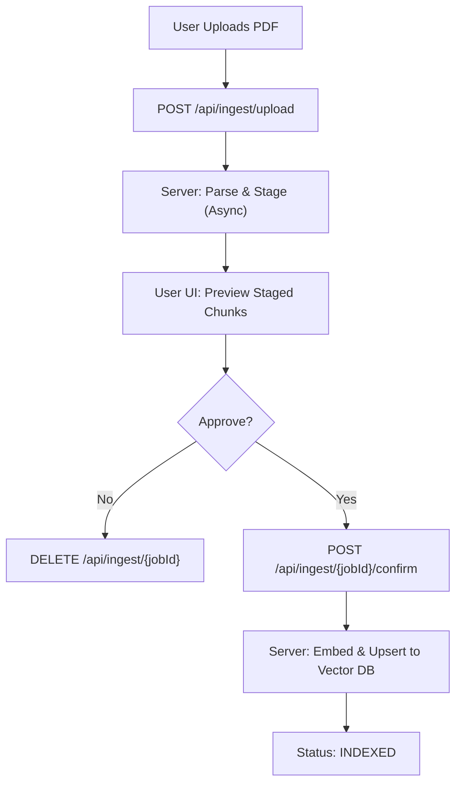

#### B. CLI Batch Flow (Automated)
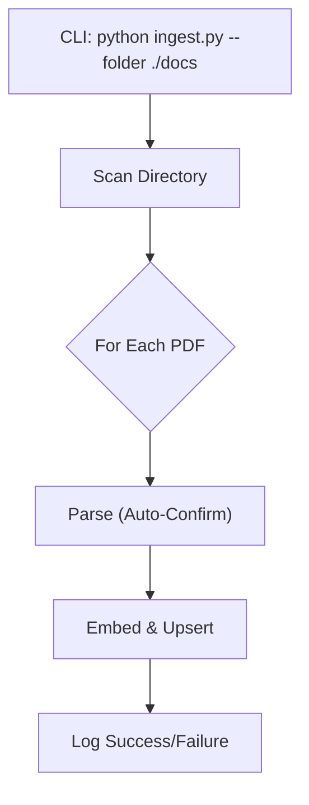

### 2. Chat Query Flow

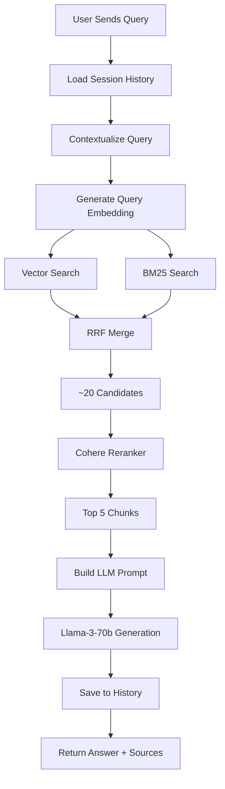

### 3. Hybrid Search Detail

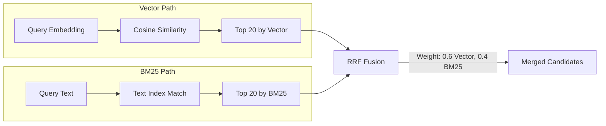

### 4. Search Feature Flow (No LLM)

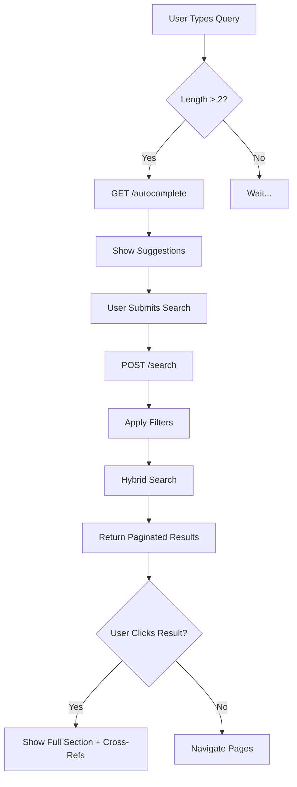

### 5. Viability Predictor Flow

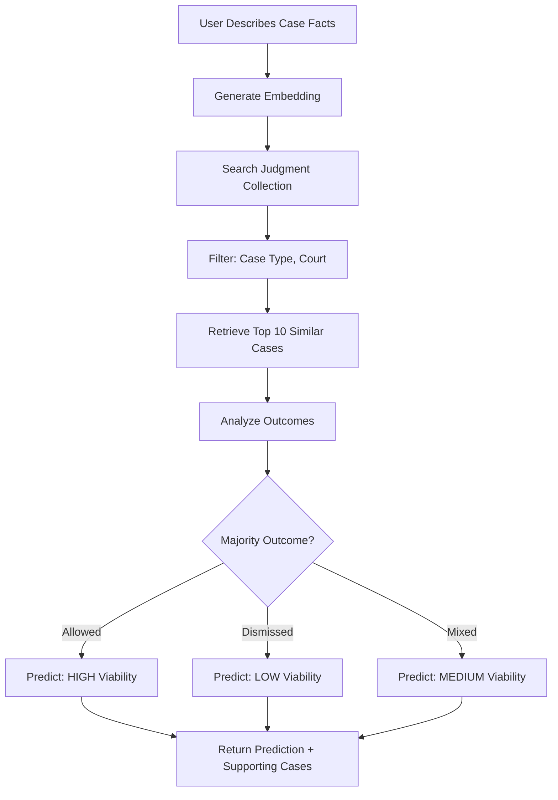

### 6. Argument Miner Flow

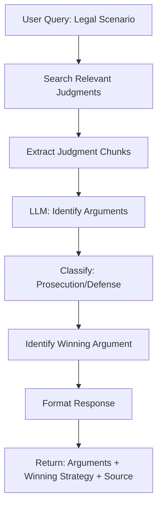

### 7. Clause Search Flow

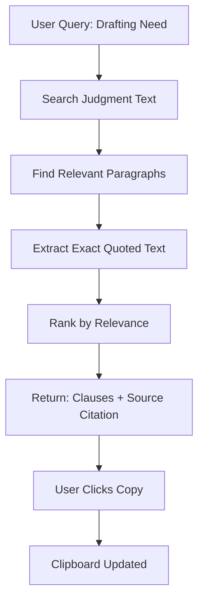

## Proposed Changes

### Project Structure & Configuration

#### [NEW] [Project Root]
- `.env.example`: Template for environment variables.
- `requirements.txt`: Python dependencies.
- `app/`: Main backend application directory.

### Environment Configuration Specification

The system relies on the following `.env` variables:

| Category | Variable Name | Description | Default |
| :--- | :--- | :--- | :--- |
| **Server** | `API_HOST` | Bind address | `0.0.0.0` |
| | `API_PORT` | Port number | `8000` |
| | `DEBUG` | Enable debug mode | `false` |
| | `LOG_LEVEL` | Logging verbosity | `INFO` |
| | `ALLOWED_ORIGINS` | CORS origins (JSON list) | `["http://localhost:5173"]` |
| **MongoDB** | `MONGO_URI` | Atlas Connection String | - |
| | `MONGO_DB` | Database Name | `legal_db` |
| | `MONGO_COLLECTION` | Chunks Collection | `legal_chunks` |
| **Embedding** | `EMBED_PROVIDER` | Provider (mistral/openai) | `mistral` |
| | `EMBED_MODEL_NAME` | Model Name | `mistral-embed` |
| | `EMBED_API_KEY` | API Key | - |
| | `EMBED_API_URL` | API Endpoint | `https://api.mistral.ai/v1/embeddings` |
| | `EMBED_RETRY_COUNT` | Retries on failure | `3` |
| **Vector Search** | `VECTOR_SEARCH_INDEX_NAME` | Atlas Index Name | `vector_index` |
| | `VECTOR_SEARCH_TOP_K` | Initial candidates | `20` |
| | `VECTOR_SEARCH_MIN_SCORE` | Minimum similarity | `0.5` |
| **BM25 Search** | `BM25_TEXT_INDEX_NAME` | Atlas Text Index Name | `text_index` |
| | `BM25_TOP_K` | Initial candidates | `20` |
| | `BM25_MIN_SCORE` | Minimum score | `0.5` |
| **Hybrid Search** | `HYBRID_VECTOR_WEIGHT` | Vector contribution | `0.6` |
| | `HYBRID_BM25_WEIGHT` | BM25 contribution | `0.4` |
| | `HYBRID_TOP_K` | Combined candidates | `20` |
| | `HYBRID_MIN_SCORE` | Final threshold | `0.7` |
| | `HYBRID_NORMALIZATION_METHOD` | Score normalization | `minmax` |
| **Reranking** | `RERANK_PROVIDER` | Provider (cohere/groq) | `cohere` |
| | `RERANK_MODEL_NAME` | Model Name | `rerank-english-v3.0` |
| | `RERANK_API_KEY` | API Key | - |
| | `RERANK_TOP_K` | Final chunks to LLM | `5` |
| **LLM (Chat)** | `LLM_PROVIDER` | Provider (groq/openai) | `groq` |
| | `LLM_MODEL` | Model Name | `llama-3.3-70b-versatile` |
| | `LLM_API_KEY` | API Key | - |
| | `LLM_API_URL` | API Endpoint | `https://api.groq.com/openai/v1/chat/completions` |
| | `LLM_TEMPERATURE` | Creativity (0.0-1.0) | `0.0` |
| | `LLM_MAX_TOKENS` | Max response tokens | `2000` |
| **Vision (OCR)** | `VISION_PROVIDER` | Provider (groq/openrouter) | `groq` |
| | `VISION_MODEL_NAME` | Vision Model | `llama-3.2-11b-vision-preview` |
| | `VISION_API_KEY` | API Key | - |
| | `VISION_API_URL` | API Endpoint | - |
| **Document Processing** | `DOC_MAX_FILE_SIZE` | Max upload size (bytes) | `10485760` |
| | `DOC_ALLOWED_EXTENSIONS` | Allowed file types | `pdf` |
| | `DOC_MIN_CHARS_FOR_OCR` | Char threshold to trigger Vision | `50` |
| **Ingestion** | `BATCH_SIZE` | Files processed at once | `10` |
| | `MAX_RETRIES` | Retries for failed files | `3` |
| | `RETRY_DELAY` | Seconds between retries | `2` |
| **Chatbot Memory** | `CHATBOT_MAX_HISTORY` | Raw turns to keep | `10` |
| | `CHATBOT_MEMORY_TYPE` | Memory strategy | `buffer` |
| **Chatbot UI** | `CHATBOT_SHOW_SOURCES` | Display source chips | `true` |
| | `CHATBOT_SHOW_SCORES` | Display relevance scores | `false` |

### Core Parser (The "Smart Parser")

#### `manager` - Main Orchestrator

```
ALGORITHM: ProcessPDF(file_path)

  INPUT:  file_path (string)
  OUTPUT: List of LegalChunk objects

  1. pages ← ExtractTextFromPDF(file_path)
       [Logic]: Apply Clip Rect (x=30, y=40, w=w-110, h=h-40) to remove margin notes.
       [Logic]: Filter Digital Signatures (OIDs like '2.5.4.20...') and footer noise.
  
  2. FOR EACH page IN pages:
       IF Length(page.text) < DOC_MIN_CHARS_FOR_OCR THEN
         page.text ← VisionLLM_ExtractText(page.image)
       END IF
     END FOR
  
  3. mode ← GetModeFromConfig(file_path)
     IF mode IS NULL THEN
       mode ← DetectModeFromContent(pages[0..20])
     END IF
  
  4. strategy ← SelectStrategy(mode)  // Narrative, Strict, or Schedule
  
  5. chunks ← strategy.Parse(pages)
  
  6. FOR EACH chunk IN chunks:
       EnrichChunk(chunk)  // Prepend [Act] > [Chapter] > [Section]
     END FOR
  
  7. RETURN chunks
END ALGORITHM
```

---

#### `NarrativeStrategy` (BNS, BSA, IPC, Contract Act)

```
ALGORITHM: NarrativeStrategy.Parse(pages)

  INPUT:  pages (list of page objects)
  OUTPUT: List of Chunk objects
  
  CONSTANTS:
    SECTION_PATTERN = "^[0-9]+[A-Z]?\."   // e.g., "3.", "302.", "44AD."
    ATTACH_KEYWORDS = ["Illustration", "Explanation"]

  1. chunks ← empty list
  2. current_chunk ← NULL
  
  3. FOR EACH line IN AllLines(pages):
  
       CASE 1: line MATCHES SECTION_PATTERN
         IF current_chunk IS NOT NULL THEN
           Append(chunks, current_chunk)
         END IF
         current_chunk ← NewChunk(line)
       
       CASE 2: line STARTS WITH any of ATTACH_KEYWORDS
         // ATTACH to previous section, do NOT create new chunk
         current_chunk.content ← current_chunk.content + "\n" + line
         current_chunk.has_illustration ← TRUE
       
       DEFAULT:
         current_chunk.content ← current_chunk.content + "\n" + line
       
     END FOR
  
  4. IF current_chunk IS NOT NULL THEN
       Append(chunks, current_chunk)
     END IF
  
  5. RETURN chunks
END ALGORITHM
```

---

#### `StrictStrategy` (BNSS, Income Tax, GST)

```
ALGORITHM: StrictStrategy.Parse(pages)

  INPUT:  pages
  OUTPUT: List of Chunk objects
  
  CONSTANTS:
    SECTION_PATTERN = "^[0-9]+[A-Z]?\." 
    ATTACH_KEYWORDS = ["Provided that"]

  1. chunks ← empty list
  2. current_chunk ← NULL
  
  3. FOR EACH line IN AllLines(pages):
  
       CASE 1: line MATCHES SECTION_PATTERN
         IF current_chunk IS NOT NULL THEN
           Append(chunks, current_chunk)
         END IF
         current_chunk ← NewChunk(line)
       
       CASE 2: line STARTS WITH "Provided that"
         // ATTACH proviso to previous sub-section
         current_chunk.content ← current_chunk.content + "\n" + line
         current_chunk.has_proviso ← TRUE
       
       DEFAULT:
         current_chunk.content ← current_chunk.content + "\n" + line
       
     END FOR
  
  4. RETURN chunks
END ALGORITHM
```

---

#### `ScheduleStrategy` (PMLA, BNSS Schedules)

```
ALGORITHM: ScheduleStrategy.Parse(pages)

  INPUT:  pages
  OUTPUT: List of Chunk objects
  
  1. chunks ← empty list
  2. in_schedule ← FALSE
  
  3. FOR EACH line IN AllLines(pages):
  
       IF "THE SCHEDULE" IN UpperCase(line) THEN
         in_schedule ← TRUE
         CONTINUE
       END IF
       
       IF in_schedule = TRUE THEN
         IF IsTableRow(line) THEN
           row ← ParseTableRow(line)  // Extract columns
           formatted ← FormatScheduleEntry(row)
           Append(chunks, NewChunk(formatted, type="Schedule_Entry"))
         END IF
       ELSE
         // Use StrictStrategy logic for pre-schedule sections
       END IF
       
     END FOR
  
  4. RETURN chunks
END ALGORITHM

---

FUNCTION: FormatScheduleEntry(row)
  // Output: "[BNSS] > Schedule I > [Offence] : Punishment is X, Y, Z, triable by Court."
  RETURN "[" + row.act + "] > " + row.schedule + " > " + row.offence + 
         " : Punishment is " + row.punishment + ", " + row.cognizable + 
         ", " + row.bailable + ", triable by " + row.court + "."
END FUNCTION
```

---

#### Data Model: `Chunk`

| Field | Type | Description |
| :--- | :--- | :--- |
| `section_id` | String | Unique ID (e.g., "BNS_Sec_103") |
| `content` | String | Raw section text |
| `chapter` | String | Parent chapter name |
| `chunk_type` | Enum | "Section", "Definition", "Schedule_Entry" |
| `has_illustration` | Boolean | TRUE if Illustration attached |
| `has_proviso` | Boolean | TRUE if Proviso attached |

---

## Parser Logic Documentation

### Parser Modes

| Mode | Purpose | Target Acts | Key Patterns |
| :--- | :--- | :--- | :--- |
| **Narrative** | Attach Illustrations/Explanations | BNS, BSA, IPC, Contract Act | `Illustration`, `Explanation` |
| **Strict** | Attach Provisos | BNSS, Income Tax, GST | `Provided that` |
| **Schedule** | Row-by-row table parsing | PMLA, BNSS Schedules | `THE SCHEDULE` |

### Detection Logic

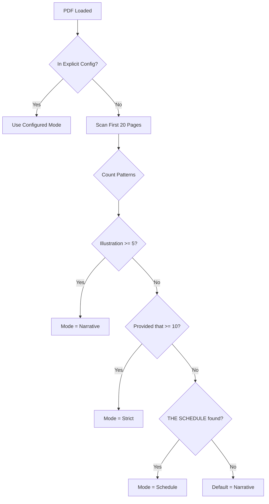

### Explicit Config (`data/parser_modes.json`)

```json
{
  "BNS": "narrative",
  "BSA": "narrative",
  "BNSS": "strict",
  "Income_Tax_Act": "strict",
  "PMLA": "schedule",
  "Contract_Act": "narrative"
}
```

### Content Detection Thresholds

| Pattern | Threshold | Detected Mode |
| :--- | :---: | :--- |
| `Illustration` or `Explanation` | >= 5 | Narrative |
| `Provided that` | >= 10 | Strict |
| `THE SCHEDULE` + table | Found | Schedule |

### Chunking Rules

1. **Section Detection**: New chunk starts with `^\d+[A-Z]?\.\s` (e.g., `3.`, `303.`, `482.`)

2. **Attachment Rules**:
   | Mode | Pattern | Action |
   | :--- | :--- | :--- |
   | Narrative | `Illustration`, `Explanation` | Append to previous Section |
   | Strict | `Provided that` | Append to previous Sub-section |
   | Schedule | Table rows | Each row = separate chunk |

3. **BNSS Schedule Handling**:
   - Format: `[BNSS] > Schedule I > [Offence] : Punishment is [Col2], [Col3], [Col4], triable by [Col5].`

4. **Bridging Logic** (PMLA):
   - Inject: *"Note: IPC Section X corresponds to BNS Section Y"*

5. **Text Enrichment**:
   - Format: `[Act Name] > [Chapter] > [Section ID + Title] : [Content]`

---

## Validation Results

### Acts Analyzed

| Act | Patterns Found | Expected Mode | Validated |
| :--- | :--- | :---: | :---: |
| **BNS** | Illustrations throughout | Narrative | ✅ |
| **BSA** | Illustrations for definitions | Narrative | ✅ |
| **IPC** | Illustrations + Explanations | Narrative | ✅ |
| **Contract Act** | Many Illustrations per section | Narrative | ✅ |
| **BNSS** | Provisos + First Schedule table | Strict + Schedule | ✅ |
| **Income Tax Act** | Heavy "Provided that" provisos | Strict | ✅ |
| **PMLA** | THE SCHEDULE with IPC references | Schedule | ✅ |
| **GST Act** | Provisos + Schedules | Strict + Schedule | ✅ |

### Confidence Assessment

| Scenario | Reliability |
| :--- | :---: |
| Explicit Config | **100%** |
| Content Detection | **~92%** |
| Combined with Fallback | **~97%** |

> [!TIP]
> Edge cases (short acts, mixed styles) can be added to explicit config as discovered.

---

### Strategy Pattern Implementation

```python
class NarrativeStrategy:
    """Attaches Illustrations/Explanations to parent Section."""
    attach_patterns = ["Illustration", "Explanation"]

class StrictStrategy:
    """Attaches Provisos to parent Sub-section."""
    attach_patterns = ["Provided that"]

class ScheduleStrategy:
    """Parses tables row-by-row."""
    trigger = "THE SCHEDULE"
```

### Database & Data Models

#### [NEW] `app/models/`
- `schema.py`: Pydantic models for API requests/responses and MongoDB documents.
    - `LegalChunk`: Strictly matches user's JSON schema.
    - `Metadata`: Nested object for filtering (Act, Category, Section ID).

### MongoDB Data Model (JSON Schema)

The database will store documents with this exact structure:

```json
{
  "_id": "BlackMoney2015_Sec_03",
  "text_for_embedding": "Black Money ... Act, 2015 > Chapter II ... > Section 3 ... [Context: ...]",
  "raw_content": "3. Charge of tax. (1) There shall be charged...",
  "embedding": [0.012, -0.234, "...", 0.987], 
  "metadata": {
    "act_name": "Black Money Act, 2015",
    "category": "Tax",
    "chapter": "II - Basis of Charge",
    "section_id": "3",
    "chunk_type": "Section", 
    "has_illustration": false,
    "has_proviso": true,
    "schedule_bridge": null 
  }
}
```

### Judgment Data Model (JSON Schema)

For **Case Law/Judgments**, use this structure:

```json
{
  "_id": "judgment_1943657_chunk_3",
  "text_for_embedding": "Gujarat High Court > Criminal > Priti Bhojnagarwala vs State Of Gujarat... The Court held that...",
  "raw_content": "JUDGMENT H.H. Mehta, J. 1. This is a group of 30 Criminal Misc. Applications...",
  "embedding": [0.012, -0.234, "...", 0.987],
  "metadata": {
    "doc_type": "judgment",
    "title": "Priti Bhojnagarwala vs State Of Gujarat",
    "court_name": "Gujarat High Court",
    "court_type": "High_Court",
    "case_type": "Criminal",
    "judgment_date": "2001-05-04",
    "doc_url": "https://indiankanoon.org/doc/1943657",
    "cites": 72,
    "cited_by": 2,
    "outcome": "Dismissed",
    "acts_cited": ["IPC 138", "CrPC 482"],
    "chunk_index": 3,
    "total_chunks": 45,
    "is_sensitive": false
  }
}
```

**Key Differences from LegalChunk**:

| Field | LegalChunk (Laws) | JudgmentChunk |
| :--- | :--- | :--- |
| `doc_type` | `"act"` / `"section"` | `"judgment"` |
| `section_id` | ✅ Yes | ❌ No |
| `court_name` | ❌ No | ✅ Yes |
| `outcome` | ❌ No | ✅ Yes (Allowed/Dismissed) |
| `chunk_index` | ❌ No | ✅ Yes (for large docs) |
| `is_sensitive` | ❌ No | ✅ Yes (POCSO/Juvenile flag) |

#### [NEW] `app/services/database.py`
- MongoDB initialization and connection management using `motor` (async).
- Index management references.

### MongoDB Atlas Index Definitions

You must create **two indexes** in MongoDB Atlas UI:

#### 1. Vector Search Index

**Index Name**: `vector_index` (must match `VECTOR_SEARCH_INDEX_NAME` in .env)

```json
{
  "fields": [
    {
      "type": "vector",
      "path": "embedding",
      "numDimensions": 1024,
      "similarity": "cosine"
    },
    {
      "type": "filter",
      "path": "metadata.act_name"
    },
    {
      "type": "filter",
      "path": "metadata.category"
    }
  ]
}
```

#### 2. Text Search Index (BM25)

**Index Name**: `text_index` (must match `BM25_TEXT_INDEX_NAME` in .env)

```json
{
  "mappings": {
    "dynamic": false,
    "fields": {
      "text_for_embedding": {
        "type": "string",
        "analyzer": "lucene.standard"
      },
      "raw_content": {
        "type": "string",
        "analyzer": "lucene.standard"
      }
    }
  }
}
```

### Retrieval Engine (Modular Pattern)

#### [NEW] `app/services/retriever.py`
- **Hybrid Search**:
    - **Vector Search**: Using `LangChain` + `Mistral` embeddings.
    - **Keyword Search**: Using `BM25` on enriched text.
    - **RRF Merge**: Logic to combine results.
- **Reranking**:
    - Integration with `Cohere` reranker to select top 5 chunks.

### LLM & Agent Integration

#### [NEW] `app/services/llm_engine.py`
- **LangChain Abstraction**:
    - `ChatGroq` setup with `Llama-3-70b`.
    - **[NEW] Memory Management**: Use `MongoDBChatMessageHistory` backed by `ConversationSummaryBufferMemory`.
        - **Strategy**: Keep last 5 turns raw; summarize older turns to save tokens.
        - **Model**: Use a smaller, faster model (e.g., Llama-3-8b) for background summarization.
    - `Chain`: `create_history_aware_retriever` to contextualize the query before search.
    - `generate_answer(session_id, query)`: Fetches history auto-magically.

### Scripts & CLI (Batch Processing)

#### [NEW] `scripts/`
- `ingest_batch.py`: Command-line script to process a local directory of PDFs.
    - Iterates through all PDFs in a target folder.
    - Calls `parser.manager` for each file.
    - Bulk upserts chunks to MongoDB for efficiency.
    - Uses `tqdm` for progress bar.
    - **[NEW] Retry Logic**: Implements exponential backoff for failed files (Max retries configured in .env).

### API Layer

#### [NEW] `app/api/`
- `routes.py`: FastAPI endpoints.
    - `POST /ingest`: Accepts List of Files, starts Background Task, returns `job_id`.
    - `GET /ingest/status/{job_id}`: Returns detailed batch progress:
        - `total_files`: 100
        - `processed_count`: 15
        - `current_file`: "IPC.pdf"
        - `current_file_progress`: 45%
    - `POST /chat`: Accepts query, runs Retrieval pipeline, returns Answer + Citations.
- `main.py`: App entry point, CORS config.

## API Specification

| Endpoint | Method | Description | Request Body | Response |
| :--- | :--- | :--- | :--- | :--- |
| `/health` | `GET` | System health check | - | `{"status": "ok"}` |
| `/api/v1/ingest` | `POST` | Start Async Batch Ingestion | `files: List[UploadFile]` | `{"job_id": "uuid", "status": "queued"}` |
| `/api/v1/ingest/status/{id}` | `GET` | Check Batch Progress | - | `{"job_status": "processing", "current_file": "IPC.pdf", "file_progress": 45, "batch_progress": "12/100"}` |
| `/api/v1/chat` | `POST` | Query the RAG system | `{"session_id": "uuid", "query": "..."}` | `{"answer": "...", "sources": [...]}` |
| `/api/v1/search` | `POST` | Direct hybrid search (no LLM) | `{"query": "...", "filters": {"act_name": "..."},  "page": 1}` | `{"results": [...], "total": 150, "page": 1}` |
| `/api/v1/autocomplete` | `GET` | Suggest acts/sections | `?q=sec` | `["Section 302", "Section 304", ...]` |
| `/api/v1/section/{id}/related` | `GET` | Cross-references | - | `[{"act": "BNS", "section": "103", "relation": "replaces IPC 302"}]` |
| `/api/v1/documents` | `GET` | List ingested files (Optional) | - | `[{"filename": "IPC.pdf", "chunk_count": 500}]` |
| `/api/v1/viability` | `POST` | Predict case outcome | `{"facts": "...", "court": "...", "case_type": "..."}` | `{"viability": "HIGH", "confidence": 85, "supporting_cases": [...]}` |
| `/api/v1/arguments` | `POST` | Extract legal arguments | `{"scenario": "..."}` | `{"prosecution": [...], "defense": [...], "winning": "...", "source": "..."}` |
| `/api/v1/clauses` | `POST` | Search legal phrasing | `{"query": "quashing FIR settlement"}` | `[{"text": "...", "source": "Case X, Para 15"}]` |

### Frontend (User Interface)

#### [NEW] `frontend/`
- **React Application** (Vite + Material UI).
    - `App.jsx`: Main layout using MUI `AppBar` and `Grid`.
    - `components/FileUpload.jsx`: stylized Dropzone.
        - **[NEW] Status Polling**: Polls `/ingest/status` every 2s until completion. Shows Progress Bar.
    - `components/SearchInterface.jsx`: Search bar + filters + paginated results list.
    - `components/ChatInterface.jsx`: MUI `Paper` components for chat bubbles, `Chip` for sources.
    - `components/ViabilityPredictor.jsx`: Case facts input, filters, prediction card, supporting cases.
    - `components/ArgumentMiner.jsx`: Scenario input, two-column arguments display, winning highlight.
    - `components/ClauseSearch.jsx`: Search bar, quoted text cards with copy buttons.
    - `api.js`: Axios service.
    - **Theme**: Enterprise Blue (`#1976d2`), Roboto font.


## Backend API Endpoints

### Ingestion API

Base URL: `http://localhost:8000/api/ingest`

#### 1. Health Check
```http
GET /health
```

**Response:**
```json
{
  "status": "healthy",
  "service": "Legal Assistant Ingestion API"
}
```

---

#### 2. Upload PDF
```http
POST /api/ingest/upload
Content-Type: multipart/form-data
```

**Request:**
- `file`: PDF file (max 25MB)

**Response:**
```json
{
  "job_id": "uuid-string",
  "filename": "BNS.pdf",
  "status": "queued",
  "message": "PDF uploaded successfully. Parsing started in background."
}
```

**Status Codes:**
- `200`: Success
- `400`: Invalid file type or size
- `500`: Server error

---

#### 3. List All Jobs
```http
GET /api/ingest/jobs
```

**Response:**
```json
[
  {
    "job_id": "uuid-1",
    "filename": "BNS.pdf",
    "status": "completed",
    "created_at": "2026-01-20T12:00:00Z"
  },
  {
    "job_id": "uuid-2",
    "filename": "BNSS.pdf",
    "status": "preview_ready",
    "created_at": "2026-01-20T12:05:00Z"
  }
]
```

---

#### 4. Get Job Status
```http
GET /api/ingest/{job_id}/status
```

**Response:**
```json
{
  "job_id": "uuid-string",
  "filename": "BNS.pdf",
  "status": "preview_ready",
  "created_at": "2026-01-20T12:00:00Z",
  "error": null
}
```

**Possible Status Values:**
- `queued`: Job created, waiting to start
- `parsing`: PDF being parsed
- `preview_ready`: Parsing complete, ready for review
- `approved`: User confirmed, ready for indexing
- `indexing`: Generating embeddings and storing in MongoDB
- `completed`: Successfully indexed
- `failed`: Error occurred (check `error` field)

---

#### 5. Get Preview
```http
GET /api/ingest/{job_id}/preview
```

**Response:**
```json
{
  "job_id": "uuid-string",
  "filename": "BNS.pdf",
  "act_name": "Bharatiya Nyaya Sanhita, 2023",
  "act_short": "BNS",
  "parsing_mode": "NARRATIVE",
  "total_pages": 200,
  "total_chunks": 358,
  "chunks": [
    {
      "chunk_id": "BNS_Sec_1",
      "text_for_embedding": "[Bharatiya Nyaya Sanhita, 2023] > [Chapter I - Preliminary] > [Section 1 - Short title, extent and commencement]\n\n(1) This Act may be called the Bharatiya Nyaya Sanhita, 2023...",
      "raw_content": "(1) This Act may be called the Bharatiya Nyaya Sanhita, 2023...",
      "metadata": {
        "act_name": "Bharatiya Nyaya Sanhita, 2023",
        "act_short": "BNS",
        "chapter": "Chapter I - Preliminary",
        "section_id": "1",
        "section_title": "Short title, extent and commencement",
        "chunk_type": "Section",
        "has_illustration": false,
        "has_explanation": false,
        "has_proviso": false,
        "page_start": 1,
        "page_end": 1
      }
    }
  ]
}
```

---

#### 6. Confirm Ingestion
```http
POST /api/ingest/{job_id}/confirm
```

**Description:** Triggers embedding generation and MongoDB insertion.

**Response:**
```json
{
  "job_id": "uuid-string",
  "status": "indexing",
  "message": "Ingestion confirmed. Embedding and indexing started."
}
```

**What Happens:**
1. Extracts `text_for_embedding` from all chunks
2. Calls Mistral API to generate 1024-dim embeddings (batched)
3. Inserts chunks + embeddings into MongoDB
4. Updates job status to `completed`

---

### MongoDB Schema

**Collection:** `legal_chunks_v1`

**Document Structure:**
```json
{
  "_id": "BNS_Sec_103",
  "chunk_id": "BNS_Sec_103",
  "text_for_embedding": "[Bharatiya Nyaya Sanhita, 2023] > [Chapter VI - Of Offences Affecting the Human Body] > [Section 103 - Murder]\n\nWhoever commits murder shall be punished with...",
  "raw_content": "Whoever commits murder shall be punished with...",
  "embedding": [0.123, -0.045, 0.678, ...],  // 1024 floats
  "metadata": {
    "act_name": "Bharatiya Nyaya Sanhita, 2023",
    "act_short": "BNS",
    "chapter": "Chapter VI - Of Offences Affecting the Human Body",
    "section_id": "103",
    "section_title": "Murder",
    "chunk_type": "Section",
    "has_illustration": false,
    "has_explanation": false,
    "has_proviso": false,
    "page_start": 45,
    "page_end": 45
  },
  "created_at": "2026-01-20T12:10:00Z"
}
```

**Indexes:**
- `_id`: Primary key (deterministic, idempotent)
- `embedding`: Vector index for similarity search (to be created)
- `metadata.act_short`: Filter by Act
- `metadata.section_id`: Lookup by section

---

### CLI Batch Ingestion

For bulk processing without UI:

```bash
python scripts/ingest_batch.py Sample_pdf/BNS.pdf
```

**Features:**
- Automatic parsing
- Automatic embedding
- Automatic MongoDB insertion
- Progress reporting
- Error handling

**Output:**
```
Processing: BNS.pdf
✓ Parsed: 358 chunks
✓ Embedded: 358 vectors
✓ Inserted: 358 documents
✓ Completed in 45.2s

Summary:
  Success: 1
  Failed: 0
  Total Chunks: 358
```

---

## Verification Plan


### Automated Tests
- **Parser Unit Tests**: Create `tests/test_parser.py` with sample text blocks to verify:
    - Section detection (Regex match).
    - Attachment logic (Illustration/Proviso checks).
    - Schedule mapping (PMLA bridge).
- **Integration Tests**: `tests/test_api.py` to mock DB and LLM, verifying endpoint status codes.

### Manual Verification
1.  **Ingestion Test**:
    - Upload a sample "IPC" PDF (Narrative Mode).
    - Verify in MongoDB Compass that "Illustrations" are appended to the correct Section chunk.
2.  **Search Test**:
    - Query: "What is the punishment for murder?"
    - Verify: Retrieval finds Section 302 (or BNS equivalent).
    - Verify: RRF merges results effectively.
3.  **Bridge Test**:
    - Upload a PMLA Schedule.
    - Context Check: Verify the "Bridge Note" appears in the `text_for_embedding`.
4.  **UI Verification**:
    - Test Drag-and-drop upload.
    - Test Chat interaction and clicking "Source Chips" reveals raw text.

### RAG Evaluation Metrics (DeepEval)

Use [DeepEval](https://github.com/confident-ai/deepeval) library to evaluate RAG pipeline quality.

**Setup**:
```bash
pip install deepeval
deepeval login  # For dashboard access
```

**Key Metrics to Evaluate**:

| Metric | What it Measures | Target Score |
| :--- | :--- | :---: |
| **Faithfulness** | Is the answer grounded in retrieved context? (No hallucination) | ≥ 0.9 |
| **Answer Relevancy** | Is the answer relevant to the question? | ≥ 0.85 |
| **Contextual Precision** | Are relevant chunks ranked higher? | ≥ 0.8 |
| **Contextual Recall** | Are all relevant chunks retrieved? | ≥ 0.75 |
| **Hallucination** | Does the answer contain fabricated information? | ≤ 0.1 |

**Test Dataset**: Create `tests/eval_dataset.json` with 50+ Q&A pairs:
```json
[
  {
    "input": "What is the punishment for murder under BNS?",
    "expected_output": "Section 103 of BNS...",
    "context": ["BNS Section 103 text..."]
  }
]
```

**Evaluation Script** (`scripts/run_deepeval.py`):
```python
from deepeval import evaluate
from deepeval.metrics import FaithfulnessMetric, AnswerRelevancyMetric
from deepeval.test_case import LLMTestCase

# Run evaluation
evaluate(test_cases, metrics=[
    FaithfulnessMetric(threshold=0.9),
    AnswerRelevancyMetric(threshold=0.85),
])
```

**CI/CD Integration**: Run DeepEval on every PR to catch regressions.

---

### Feature-Specific Evaluation

DeepEval applies to **all RAG features** with tailored metrics:

| Feature | Primary Metrics | Special Consideration |
| :--- | :--- | :--- |
| **Legal Chat** | Faithfulness, Answer Relevancy, Contextual Recall | General Q&A accuracy |
| **Viability Predictor** | Faithfulness, Contextual Precision | Compare predicted vs actual outcome |
| **Argument Miner** | Faithfulness, Answer Relevancy | Verify arguments exist in source |
| **Clause Search** | Contextual Precision, Contextual Recall | Exact quote match % |

**Test Datasets per Feature**:
```
tests/
├── eval_chat.json         # Legal Chat Q&A pairs (50+)
├── eval_viability.json    # Case scenarios with known outcomes (30+)
├── eval_arguments.json    # Scenarios with expected arguments (30+)
└── eval_clauses.json      # Drafting queries with expected clauses (30+)
```

**Feature-Specific Custom Metrics**:

| Feature | Custom Metric | Formula |
| :--- | :--- | :--- |
| **Viability** | Outcome Accuracy | `correct_predictions / total_predictions` |
| **Argument Miner** | Argument Coverage | `found_arguments / expected_arguments` |
| **Clause Search** | Quote Exactness | `Levenshtein similarity to source` |
